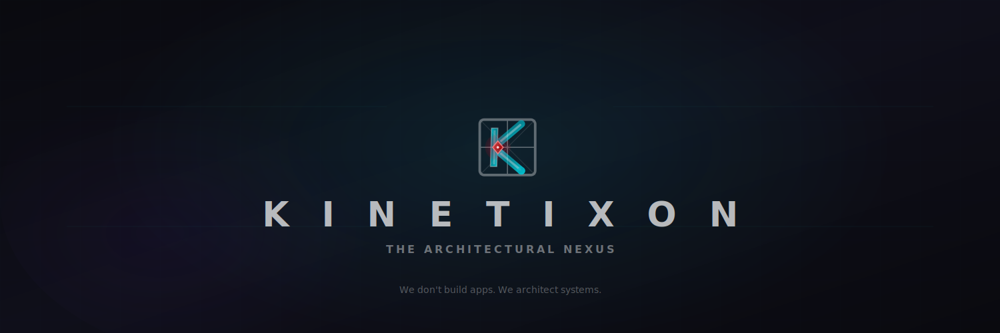

<p align="center">
  
</p>

<p align="center">
  <em>"We don't build apps. We architect systems."</em>
</p>

<p align="center">
  
  
</p>

---

### Who I Am

I'm **Alwande Gumede** — a 20-year-old **System Architect** from South Africa.

I founded **[Kinetixon](https://kinetixon.com)** — a technology company that designs, architects, and builds enterprise software systems from the ground up. No templates. No shortcuts. Every system is original, engineered from zero.

---

### Systems Built

| # | System | Description | Status | Details |
|:-:|--------|-------------|:------:|:-------:|
| 01 | **Flow Logistics** | Real-time fleet management — live GPS, AI driver scoring, weather-aware routing | 🔴 Dev | [→ View](systems/01-flow-logistics.md) |
| 02 | **StreamXChat** | Live streaming platform — built to compete globally with Twitch & Kick | 🔴 Dev | [→ View](systems/02-streamxchat.md) |

---

### Core Principles

```
SYSTEMS THINKING   →  Complete platforms, not features
REAL-TIME FIRST    →  Live data, instant updates, zero delay
SCALE READY        →  100 to 100,000 users without breaking
GROUND UP          →  No templates, no shortcuts, pure architecture
```

---

### Tech Stack

<p>
  
  
  
  
  
  
  
  
  
  
</p>

---

<p align="center">
  <a href="https://kinetixon.com"></a>
  <a href="https://linkedin.com/in/alwande-gumede"></a>
  <a href="https://twitter.com/kinetixon"></a>
</p>

<p align="center">
  
</p>

<p align="center">
  <sub>Kinetixon — The Architectural Nexus · South Africa 🇿🇦</sub>
</p>
